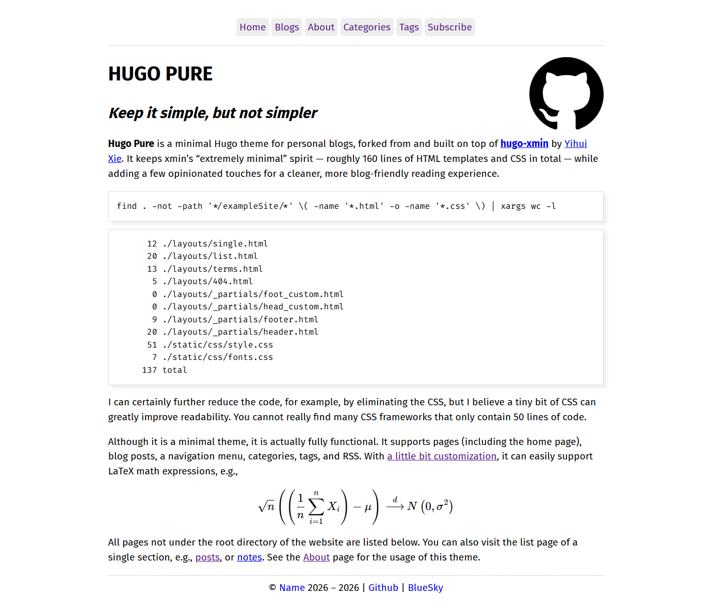

# HUGO PURE

## _Keep it simple, but not simpler_

**Hugo Pure** is a minimal Hugo theme for personal blogs, forked from and built
on top of [**hugo-xmin**](https://github.com/yihui/hugo-xmin) by
[Yihui Xie](https://yihui.org). It keeps xmin's "extremely minimal" spirit —
roughly 160 lines of HTML templates and CSS in total — while adding a few
opinionated touches for a cleaner, more blog-friendly reading experience.

[](images/screenshot.png)

## What's different from hugo-xmin?

- **Homepage is intro-only.** The home page renders just the content of
  `_index.md` instead of dumping every post. Your blog index lives at `/post/`.
- **Blog index grouped by year.** The `/post/` listing groups posts under year
  headings (`2026`, `2025`, …), so archives are easier to scan. Other sections
  (e.g. `/note/`) keep the original flat, date-sorted list.
- **"Blogs" nav entry.** The example site config adds a `Blogs → /post/` menu
  item so the blog index is one click away.
- **Math & images out of the box.** KaTeX rendering and image auto-centering are
  baked into the theme via `foot_custom.html` (no longer something you have to
  copy from the example site). Supports `$...$`, `$$...$$`, `\(...\)`, and
  `\[...\]`.
- **Cleaner footer placeholder.** `params.footer` ships with generic
  `[Name]`/`example` placeholders and a `{Year}` token that auto-fills the
  current year.
- **`locale`-based `<html lang>`.** The page language is driven by the
  top-level `locale` config, via `.Site.Language.Locale`.
- **Web fonts out of the box.** `head_custom.html` loads
  [Fira Sans](https://fonts.google.com/specimen/Fira+Sans) (Latin, sans),
  [Noto Serif SC / 思源宋体](https://fonts.google.com/specimen/Noto+Serif+SC)
  (CJK, serif), and [Fira Code](https://fonts.google.com/specimen/Fira+Code)
  (code) from jsDelivr's `@fontsource`, and `static/css/fonts.css` applies them.
  Only the 400 and 700 weights are loaded to keep the payload small; see
  [Fonts](#fonts) for details.

Everything else - the ~50-line stylesheet and the partial-based layout - is
unchanged from xmin; `head_custom.html` and `foot_custom.html` remain available
as override hooks (see [Customization](#customization)).

## Line count

Still tiny:

```bash
find . -not -path '*/exampleSite/*' \( -name '*.html' -o -name '*.css' \) | xargs wc -l
```

```
      19 ./layouts/post/list.html
       9 ./layouts/_partials/footer.html
       7 ./layouts/_partials/foot_custom.html
      20 ./layouts/_partials/header.html
       7 ./layouts/_partials/head_custom.html
       5 ./layouts/404.html
      20 ./layouts/list.html
      12 ./layouts/single.html
      13 ./layouts/terms.html
       8 ./static/css/fonts.css
      51 ./static/css/style.css
     171 total
```

## Features

- Single-column, centered, readable layout (~800px)
- Top nav menu, configurable via `menu.main`
- Post listing grouped by year (`/post/`)
- Category and tag taxonomy pages (`/categories/`, `/tags/`)
- Author and date metadata on posts (via `author` / `date` front matter)
- KaTeX math rendering (`$...$`, `$$...$$`, `\(...\)`, `\[...\]`)
- Automatic image centering
- Web fonts via CDN: Fira Sans (Latin) + Noto Serif SC (CJK serif) + Fira Code (code)
- Configurable footer with `{Year}` placeholder
- RSS feed and a 404 page

## Requirements

- Hugo (extended edition not required)

## Installation

```bash
cd your-site
git clone https://github.com/Case3y/hugo-pure.git themes/hugo-pure
```

Then set the theme in your site config (`hugo.yaml`):

```yaml
theme: "hugo-pure"
```

## Configuration

A minimal `hugo.yaml`:

```yaml
baseurl: "https://example.org/"
locale: "en-us"
title: "My Site"
theme: "hugo-pure"

permalinks:
  note: "/note/:year/:month/:day/:slug/"
  post: "/post/:year/:month/:day/:slug/"

menu:
  main:
    - name: Home
      url: ""
      weight: 1
    - name: Blogs
      url: "post/"
      weight: 2
    - name: About
      url: "about/"
      weight: 3
    - name: Categories
      url: "categories/"
      weight: 4
    - name: Tags
      url: "tags/"
      weight: 5
    - name: Subscribe
      url: "index.xml"

params:
  description: "A minimal Hugo blog."
  footer: "&copy; [Name](https://example.org) 2026 -- {Year} | [GitHub](https://github.com/example)"

markup:
  highlight:
    codeFences: false
  goldmark:
    renderer:
      unsafe: true
    extensions:
      passthrough:
        enable: true
        delimiters:
          block:
          - - \[
            - \]
          - - $$
            - $$
          inline:
          - - \(
            - \)
```

### Key settings

| Setting | What it does |
|---|---|
| `locale` | Sets `<html lang="...">` via `.Site.Language.Locale`. Use `zh-cn`, `en-us`, etc. |
| `menu.main` | Top navigation entries. `url` is relative; `weight` sets order. |
| `params.footer` | Footer HTML/Markdown. `{Year}` is replaced with the current year. |
| `permalinks` | URL patterns for the `post` and `note` sections. |
| `markup.highlight.codeFences` | `false` = no built-in syntax highlighting (xmin default). Set `true` to enable. |
| `markup.goldmark.extensions.passthrough` | Lets you write math with `\(...\)` / `\[...\]` directly in Markdown. |
| `markup.goldmark.renderer.unsafe` | `true` allows raw HTML in Markdown. |

> **Tip — bilingual blogs.** If you publish posts in multiple languages, you can
> set the language per post by adding `lang: zh-cn` (or `en-us`) to its front
> matter, then override `layouts/_partials/header.html` in your site with
> `<html lang="{{ .Page.Params.lang | default .Site.Language.Locale }}">`. The
> site-wide `locale` then acts as the default for the homepage and listing
> pages.

## Math

Inline: `$E = mc^2$` or `\(E = mc^2\)`. Display:

```
$$
\int_0^\infty e^{-x^2}\, dx = \frac{\sqrt{\pi}}{2}
$$
```

Rendering is done client-side by KaTeX, loaded from jsDelivr in
`layouts/_partials/foot_custom.html`.

## Fonts

Web fonts are loaded from jsDelivr (`@fontsource`) in
`layouts/_partials/head_custom.html` and applied in `static/css/fonts.css`:

- **Latin body text** - [Fira Sans](https://fonts.google.com/specimen/Fira+Sans) (sans-serif)
- **CJK body text** - [Noto Serif SC / 思源宋体](https://fonts.google.com/specimen/Noto+Serif+SC) (serif)
- **Code** - [Fira Code](https://fonts.google.com/specimen/Fira+Code) (monospace)

Only the 400 (regular) and 700 (bold) weights are loaded, to keep the payload
small. Because Fira Sans has no CJK glyphs, Chinese characters automatically
fall through the `font-family` stack to Noto Serif SC, so you get sans Latin
+ serif CJK by default:

```css
body {
  font-family: "Fira Sans", "Noto Serif SC", serif;
}
```

To use different fonts or weights, edit `head_custom.html` (the `<link>`s) and
`fonts.css` (the stacks), or override them in your site's `layouts/` and
`static/` directories.

## Customization

Two extension hooks let you inject code without touching the theme:

- `layouts/_partials/head_custom.html` - added inside `<head>`. Ships the
  web-font `<link>`s by default (see [Fonts](#fonts)); add your own
  CSS/analytics here or override it in your site's `layouts/`.
- `layouts/_partials/foot_custom.html` — added at the end of `<footer>`
  (currently holds the KaTeX / image-centering scripts; override it in your
  project's `layouts/` directory to change).

To override any template, copy it from `themes/hugo-pure/layouts/` into your
site's `layouts/` directory and edit — Hugo's lookup gives your site's version
priority.

## Acknowledgements

Based on [hugo-xmin](https://github.com/yihui/hugo-xmin) by
[Yihui Xie](https://yihui.org). The minimal template structure, stylesheet, and
overall philosophy are all inherited from it.

## License

MIT, inherited from [hugo-xmin](https://github.com/yihui/hugo-xmin). See
[LICENSE.md](LICENSE.md).
